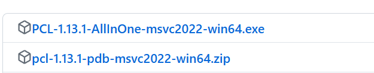
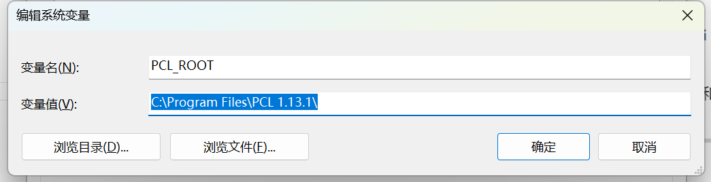
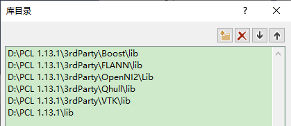

# 内螺纹检测设备

****
由于本软件需要对点云进行多种运算处理，选择使用PCL开源的点云处理算法库进行集成；
所以算法部分采用了C++的混合编程方式；
以下为注意事项：

// pcl 1.14.1 默认flann中只支持C++ 11，所以要修改flann头文件 支持C++ 17 and later，否则无法编译。

| 序号 | 技术      | 采用方案                     |
| ---- |---------|--------------------------   |
| 1    | 编程语言    | C++ 20 ,C# 8.0 .net framework 4.8    |
| 2    | 点云工具库   | PCL 1.13.1               |
| 3    | 可视化工具库  | VTK 9.2.6             |
| 4    | IDE（开发环境） | VS2022       |
| 5    | 编译器     | MSVC 2022         |
| 7    | 运行环境    | Windows          |

## 安装环境

### 1.下载PCL预编译安装程序

* PCL-1.14.1-AllInOne-msvc2022-win64.exe；
* pcl-1.14.1-pdb-msvc2022-win64.zip；

pcl下载地址,可以考虑挂梯子，否则下载比较慢。

<https://github.com/PointCloudLibrary/pcl/releases/tag/pcl-1.13.1>



### 2.安装pcl点云库

_**双击 PCL-1.14.1-AllInOne-msvc2022-win64.exe进行安装。选择第二项。**_
建议直接安装在C盘就可以，当然也可以安装在其他盘，但是环境变量一定要核对好。


_**下一步， 之后点击安装即可。**_

    一段时间之后，会弹出来一个OpenNI2的安装窗口，此时将OpenNI2放在3rdparty文件夹里；
即c:\Program files\PCL 1.13.1\3rdParty\OpenNI2。由于点云在安装的过程中会把所有的第三方库全部安装在点云安装目录下的3rdparty文件夹里。因此，为了保持文件夹的整洁，把OpenNI2放在3rdparty文件夹里。


 如果3rdParty文件夹下的OpenNI2内容为空，可以将其移除：在PCL安装路径下的3rdParty/OpenNI2文件夹内可以看到安装包OpenNI-Windows-x64-2.2.msi，双击运行，选择Remove移除安装再重新安装即可。


_**配置PDB文件**_
如果不需要继续pcl点云的开发和调试工作，pdb文件可以不用配置；

将下载得到的压缩包pcl-1.13.1-pdb-msvc2022-win64.zip解压缩后将里面的文件复制到PCL安装目录下bin文件夹，至此点云库安装完成，安装目录和3rdparty文件夹如下表所示：


****

## 环境变量确认

1. PCL_ROOT=C:\Program Files\PCL 1.13.1



2.OPENNI2


3.pcl 由于本项目不需要qt，所以可以不用关注qt的环境变量


****
_**本项目pcl的C++程序已经封装好，按照上面安装好pcl点云库后，可以直接使用，如果希望继续开发pclsharp的C++程序，可以继续下面的操作。并且本项目C++的包含目录和库目录已经按照下述说明配置好，正常便可以直接使用，但是也可以进一步参考。平时可以取消PclSharp的编译，方便C#程序的调试和运行**_

## 配置C++开发环境和调试环境

1.C++语言和输出路径设置：
    
2.C++ 高级设置
    

_**由于C#调用C++，但是pcl不支持公共语言clr，所以公共语言运行时一定不能启用。**_

3.debug配置
    

    command，由于启动程序为shell.exe 所以指向主进程；
`Environment:PATH=$(PCL_ROOT)bin;$(PCL_ROOT)3rdParty\VTK\bin;$(PCL_ROOT)3rdParty\FLANN\bin;$(PCL_ROOT)3rdParty\OpenNI2\Tools;$(PCL_ROOT)3rdParty\Qhull\bin;`

4.C++ 高级，编译为C++ code


5.C/C++ 常规 SDL检查:否
  

6.C/C++ 语言 符合模式 ：否
  

_**配置预处理器:debug模式可以如下配置，release模式只添加后面三项即可**_

```cpp
{
    _DEBUG
    _CONSOLE
    _CRT_SECURE_NO_WARNINGS
    BOOST_USE_WINDOWS_H
    NOMINMAX
    _CRT_SECURE_NO_DEPRECATE
}
```

7.C/C++ 代码生成 ：启用增强指令集（pcl1.13.0新增）


8.调试 环境：编辑如下内容


```text
# 是一行，千万不要换行，要不只能识别第一个路径，后续的识别不到
# 路径名里的“D:\Program Files\PCL 1.13.0”替换为自己实际的安装目录名称，之后的步骤里同理
PATH=D:\Program Files\PCL 1.13.0\bin;D:\Program Files\PCL 1.13.0\3rdParty\VTK\bin;D:\Program Files\PCL 1.13.0\3rdParty\FLANN\bin;D:\Program Files\PCL 1.13.0\3rdParty\OpenNI2\Tools;D:\Program Files\PCL 1.13.0\3rdParty\Qhull\bin
```

9.库目录和包含目录 注意$(PCL_ROOT) 最后一个是否带 \号
包含目录
$(PCL_ROOT)3rdParty\Boost\include\boost-1_82;
$(PCL_ROOT)3rdParty\Eigen\eigen3;
$(PCL_ROOT)3rdParty\FLANN\include;
$(PCL_ROOT)3rdParty\OpenNI2\Include;
$(PCL_ROOT)3rdParty\Qhull\include;
$(PCL_ROOT)3rdParty\VTK\include\vtk-9.2;
$(PCL_ROOT)include\pcl-1.13


库目录
$(PCL_ROOT)3rdParty\Boost\lib;
$(PCL_ROOT)3rdParty\FLANN\lib;
$(PCL_ROOT)3rdParty\OpenNI2\Lib;
$(PCL_ROOT)3rdParty\Qhull\lib;
$(PCL_ROOT)3rdParty\VTK\lib;
$(PCL_ROOT)lib



10.附加依赖项
debug 模式

```text
pcl_commond.lib
pcl_featuresd.lib
pcl_filtersd.lib
pcl_iod.lib
pcl_io_plyd.lib
pcl_kdtreed.lib
pcl_keypointsd.lib
pcl_mld.lib
pcl_octreed.lib
pcl_outofcored.lib
pcl_peopled.lib
pcl_recognitiond.lib
pcl_registrationd.lib
pcl_sample_consensusd.lib
pcl_searchd.lib
pcl_segmentationd.lib
pcl_stereod.lib
pcl_surfaced.lib
pcl_trackingd.lib
pcl_visualizationd.lib
vtkcgns-9.3-gd.lib
vtkChartsCore-9.3-gd.lib
vtkCommonColor-9.3-gd.lib
vtkCommonComputationalGeometry-9.3-gd.lib
vtkCommonCore-9.3-gd.lib
vtkCommonDataModel-9.3-gd.lib
vtkCommonExecutionModel-9.3-gd.lib
vtkCommonMath-9.3-gd.lib
vtkCommonMisc-9.3-gd.lib
vtkCommonSystem-9.3-gd.lib
vtkCommonTransforms-9.3-gd.lib
vtkDICOMParser-9.3-gd.lib
vtkDomainsChemistry-9.3-gd.lib
vtkDomainsChemistryOpenGL2-9.3-gd.lib
vtkdoubleconversion-9.3-gd.lib
vtkexodusII-9.3-gd.lib
vtkexpat-9.3-gd.lib
vtkFiltersAMR-9.3-gd.lib
vtkFiltersCellGrid-9.3-gd.lib
vtkFiltersCore-9.3-gd.lib
vtkFiltersExtraction-9.3-gd.lib
vtkFiltersFlowPaths-9.3-gd.lib
vtkFiltersGeneral-9.3-gd.lib
vtkFiltersGeneric-9.3-gd.lib
vtkFiltersGeometry-9.3-gd.lib
vtkFiltersGeometryPreview-9.3-gd.lib
vtkFiltersHybrid-9.3-gd.lib
vtkFiltersHyperTree-9.3-gd.lib
vtkFiltersImaging-9.3-gd.lib
vtkFiltersModeling-9.3-gd.lib
vtkFiltersParallel-9.3-gd.lib
vtkFiltersParallelImaging-9.3-gd.lib
vtkFiltersPoints-9.3-gd.lib
vtkFiltersProgrammable-9.3-gd.lib
vtkFiltersReduction-9.3-gd.lib
vtkFiltersSelection-9.3-gd.lib
vtkFiltersSMP-9.3-gd.lib
vtkFiltersSources-9.3-gd.lib
vtkFiltersStatistics-9.3-gd.lib
vtkFiltersTensor-9.3-gd.lib
vtkFiltersTexture-9.3-gd.lib
vtkFiltersTopology-9.3-gd.lib
vtkFiltersVerdict-9.3-gd.lib
vtkfmt-9.3-gd.lib
vtkfreetype-9.3-gd.lib
vtkGeovisCore-9.3-gd.lib
vtkgl2ps-9.3-gd.lib
vtkglew-9.3-gd.lib
vtkhdf5-9.3-gd.lib
vtkhdf5_hl-9.3-gd.lib
vtkImagingColor-9.3-gd.lib
vtkImagingCore-9.3-gd.lib
vtkImagingFourier-9.3-gd.lib
vtkImagingGeneral-9.3-gd.lib
vtkImagingHybrid-9.3-gd.lib
vtkImagingMath-9.3-gd.lib
vtkImagingMorphological-9.3-gd.lib
vtkImagingSources-9.3-gd.lib
vtkImagingStatistics-9.3-gd.lib
vtkImagingStencil-9.3-gd.lib
vtkInfovisCore-9.3-gd.lib
vtkInfovisLayout-9.3-gd.lib
vtkInteractionImage-9.3-gd.lib
vtkInteractionStyle-9.3-gd.lib
vtkInteractionWidgets-9.3-gd.lib
vtkIOAMR-9.3-gd.lib
vtkIOAsynchronous-9.3-gd.lib
vtkIOCellGrid-9.3-gd.lib
vtkIOCesium3DTiles-9.3-gd.lib
vtkIOCGNSReader-9.3-gd.lib
vtkIOChemistry-9.3-gd.lib
vtkIOCityGML-9.3-gd.lib
vtkIOCONVERGECFD-9.3-gd.lib
vtkIOCore-9.3-gd.lib
vtkIOEnSight-9.3-gd.lib
vtkIOExodus-9.3-gd.lib
vtkIOExport-9.3-gd.lib
vtkIOExportGL2PS-9.3-gd.lib
vtkIOExportPDF-9.3-gd.lib
vtkIOFLUENTCFF-9.3-gd.lib
vtkIOGeometry-9.3-gd.lib
vtkIOHDF-9.3-gd.lib
vtkIOImage-9.3-gd.lib
vtkIOImport-9.3-gd.lib
vtkIOInfovis-9.3-gd.lib
vtkIOIOSS-9.3-gd.lib
vtkIOLegacy-9.3-gd.lib
vtkIOLSDyna-9.3-gd.lib
vtkIOMINC-9.3-gd.lib
vtkIOMotionFX-9.3-gd.lib
vtkIOMovie-9.3-gd.lib
vtkIONetCDF-9.3-gd.lib
vtkIOOggTheora-9.3-gd.lib
vtkIOParallel-9.3-gd.lib
vtkIOParallelXML-9.3-gd.lib
vtkIOPLY-9.3-gd.lib
vtkIOSegY-9.3-gd.lib
vtkIOSQL-9.3-gd.lib
vtkioss-9.3-gd.lib
vtkIOTecplotTable-9.3-gd.lib
vtkIOVeraOut-9.3-gd.lib
vtkIOVideo-9.3-gd.lib
vtkIOXML-9.3-gd.lib
vtkIOXMLParser-9.3-gd.lib
vtkjpeg-9.3-gd.lib
vtkjsoncpp-9.3-gd.lib
vtkkissfft-9.3-gd.lib
vtklibharu-9.3-gd.lib
vtklibproj-9.3-gd.lib
vtklibxml2-9.3-gd.lib
vtkloguru-9.3-gd.lib
vtklz4-9.3-gd.lib
vtklzma-9.3-gd.lib
vtkmetaio-9.3-gd.lib
vtknetcdf-9.3-gd.lib
vtkogg-9.3-gd.lib
vtkParallelCore-9.3-gd.lib
vtkParallelDIY-9.3-gd.lib
vtkpng-9.3-gd.lib
vtkpugixml-9.3-gd.lib
vtkRenderingAnnotation-9.3-gd.lib
vtkRenderingCellGrid-9.3-gd.lib
vtkRenderingContext2D-9.3-gd.lib
vtkRenderingContextOpenGL2-9.3-gd.lib
vtkRenderingCore-9.3-gd.lib
vtkRenderingFreeType-9.3-gd.lib
vtkRenderingGL2PSOpenGL2-9.3-gd.lib
vtkRenderingHyperTreeGrid-9.3-gd.lib
vtkRenderingImage-9.3-gd.lib
vtkRenderingLabel-9.3-gd.lib
vtkRenderingLICOpenGL2-9.3-gd.lib
vtkRenderingLOD-9.3-gd.lib
vtkRenderingOpenGL2-9.3-gd.lib
vtkRenderingSceneGraph-9.3-gd.lib
vtkRenderingUI-9.3-gd.lib
vtkRenderingVolume-9.3-gd.lib
vtkRenderingVolumeOpenGL2-9.3-gd.lib
vtkRenderingVtkJS-9.3-gd.lib
vtksqlite-9.3-gd.lib
vtksys-9.3-gd.lib
vtkTestingRendering-9.3-gd.lib
vtktheora-9.3-gd.lib
vtktiff-9.3-gd.lib
vtkverdict-9.3-gd.lib
vtkViewsContext2D-9.3-gd.lib
vtkViewsCore-9.3-gd.lib
vtkViewsInfovis-9.3-gd.lib
vtkWrappingTools-9.3-gd.lib
vtkzlib-9.3-gd.lib

```

release 模式

```
pcl_common.lib
pcl_features.lib
pcl_filters.lib
pcl_io.lib
pcl_io_ply.lib
pcl_kdtree.lib
pcl_keypoints.lib
pcl_ml.lib
pcl_octree.lib
pcl_outofcore.lib
pcl_people.lib
pcl_recognition.lib
pcl_registration.lib
pcl_sample_consensus.lib
pcl_search.lib
pcl_segmentation.lib
pcl_stereo.lib
pcl_surface.lib
pcl_tracking.lib
pcl_visualization.lib
vtkcgns-9.3.lib
vtkChartsCore-9.3.lib
vtkCommonColor-9.3.lib
vtkCommonComputationalGeometry-9.3.lib
vtkCommonCore-9.3.lib
vtkCommonDataModel-9.3.lib
vtkCommonExecutionModel-9.3.lib
vtkCommonMath-9.3.lib
vtkCommonMisc-9.3.lib
vtkCommonSystem-9.3.lib
vtkCommonTransforms-9.3.lib
vtkDICOMParser-9.3.lib
vtkDomainsChemistry-9.3.lib
vtkDomainsChemistryOpenGL2-9.3.lib
vtkdoubleconversion-9.3.lib
vtkexodusII-9.3.lib
vtkexpat-9.3.lib
vtkFiltersAMR-9.3.lib
vtkFiltersCellGrid-9.3.lib
vtkFiltersCore-9.3.lib
vtkFiltersExtraction-9.3.lib
vtkFiltersFlowPaths-9.3.lib
vtkFiltersGeneral-9.3.lib
vtkFiltersGeneric-9.3.lib
vtkFiltersGeometry-9.3.lib
vtkFiltersGeometryPreview-9.3.lib
vtkFiltersHybrid-9.3.lib
vtkFiltersHyperTree-9.3.lib
vtkFiltersImaging-9.3.lib
vtkFiltersModeling-9.3.lib
vtkFiltersParallel-9.3.lib
vtkFiltersParallelImaging-9.3.lib
vtkFiltersPoints-9.3.lib
vtkFiltersProgrammable-9.3.lib
vtkFiltersReduction-9.3.lib
vtkFiltersSelection-9.3.lib
vtkFiltersSMP-9.3.lib
vtkFiltersSources-9.3.lib
vtkFiltersStatistics-9.3.lib
vtkFiltersTensor-9.3-gd.lib
vtkFiltersTensor-9.3.lib
vtkFiltersTexture-9.3.lib
vtkFiltersTopology-9.3.lib
vtkFiltersVerdict-9.3.lib
vtkfmt-9.3.lib
vtkfreetype-9.3.lib
vtkGeovisCore-9.3.lib
vtkgl2ps-9.3.lib
vtkglew-9.3.lib
vtkhdf5-9.3.lib
vtkhdf5_hl-9.3.lib
vtkImagingColor-9.3.lib
vtkImagingCore-9.3.lib
vtkImagingFourier-9.3.lib
vtkImagingGeneral-9.3.lib
vtkImagingHybrid-9.3.lib
vtkImagingMath-9.3.lib
vtkImagingMorphological-9.3.lib
vtkImagingSources-9.3.lib
vtkImagingStatistics-9.3.lib
vtkImagingStencil-9.3.lib
vtkInfovisCore-9.3.lib
vtkInfovisLayout-9.3.lib
vtkInteractionImage-9.3.lib
vtkInteractionStyle-9.3.lib
vtkInteractionWidgets-9.3.lib
vtkIOAMR-9.3.lib
vtkIOAsynchronous-9.3.lib
vtkIOCellGrid-9.3.lib
vtkIOCesium3DTiles-9.3.lib
vtkIOCGNSReader-9.3.lib
vtkIOChemistry-9.3.lib
vtkIOCityGML-9.3.lib
vtkIOCONVERGECFD-9.3.lib
vtkIOCore-9.3.lib
vtkIOEnSight-9.3.lib
vtkIOExodus-9.3.lib
vtkIOExport-9.3.lib
vtkIOExportGL2PS-9.3.lib
vtkIOExportPDF-9.3.lib
vtkIOFLUENTCFF-9.3.lib
vtkIOGeometry-9.3.lib
vtkIOHDF-9.3.lib
vtkIOImage-9.3.lib
vtkIOImport-9.3.lib
vtkIOInfovis-9.3.lib
vtkIOIOSS-9.3.lib
vtkIOLegacy-9.3.lib
vtkIOLSDyna-9.3.lib
vtkIOMINC-9.3.lib
vtkIOMotionFX-9.3.lib
vtkIOMovie-9.3.lib
vtkIONetCDF-9.3.lib
vtkIOOggTheora-9.3.lib
vtkIOParallel-9.3.lib
vtkIOParallelXML-9.3.lib
vtkIOPLY-9.3.lib
vtkIOSegY-9.3.lib
vtkIOSQL-9.3.lib
vtkioss-9.3.lib
vtkIOTecplotTable-9.3.lib
vtkIOVeraOut-9.3.lib
vtkIOVideo-9.3.lib
vtkIOXML-9.3.lib
vtkIOXMLParser-9.3.lib
vtkjpeg-9.3.lib
vtkjsoncpp-9.3.lib
vtkkissfft-9.3.lib
vtklibharu-9.3.lib
vtklibproj-9.3.lib
vtklibxml2-9.3.lib
vtkloguru-9.3.lib
vtklz4-9.3.lib
vtklzma-9.3.lib
vtkmetaio-9.3.lib
vtknetcdf-9.3.lib
vtkogg-9.3.lib
vtkParallelCore-9.3.lib
vtkParallelDIY-9.3.lib
vtkpng-9.3.lib
vtkpugixml-9.3.lib
vtkRenderingAnnotation-9.3.lib
vtkRenderingCellGrid-9.3.lib
vtkRenderingContext2D-9.3.lib
vtkRenderingContextOpenGL2-9.3.lib
vtkRenderingCore-9.3.lib
vtkRenderingFreeType-9.3.lib
vtkRenderingGL2PSOpenGL2-9.3.lib
vtkRenderingHyperTreeGrid-9.3.lib
vtkRenderingImage-9.3.lib
vtkRenderingLabel-9.3.lib
vtkRenderingLICOpenGL2-9.3.lib
vtkRenderingLOD-9.3.lib
vtkRenderingOpenGL2-9.3.lib
vtkRenderingSceneGraph-9.3.lib
vtkRenderingUI-9.3.lib
vtkRenderingVolume-9.3.lib
vtkRenderingVolumeOpenGL2-9.3.lib
vtkRenderingVtkJS-9.3.lib
vtksqlite-9.3.lib
vtksys-9.3.lib
vtkTestingRendering-9.3.lib
vtktheora-9.3.lib
vtktiff-9.3.lib
vtkverdict-9.3.lib
vtkViewsContext2D-9.3.lib
vtkViewsCore-9.3.lib
vtkViewsInfovis-9.3.lib
vtkWrappingTools-9.3.lib
vtkzlib-9.3.lib

```